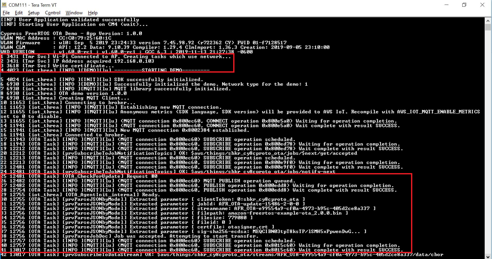
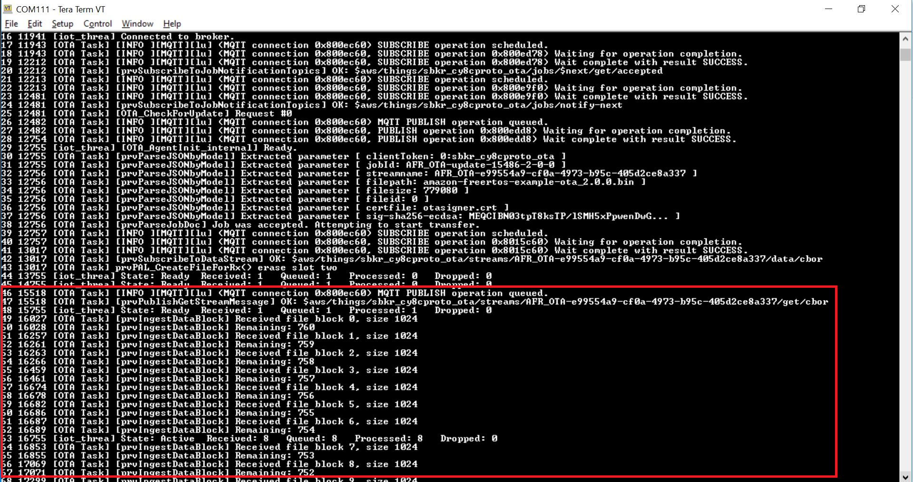
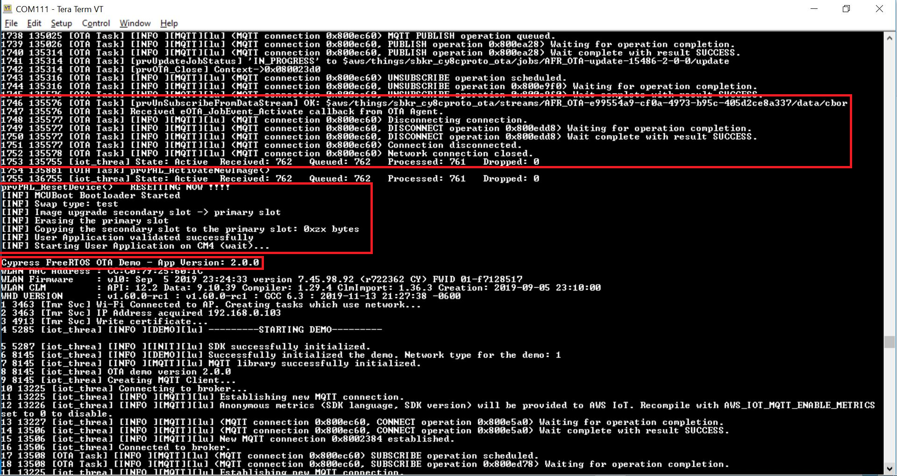
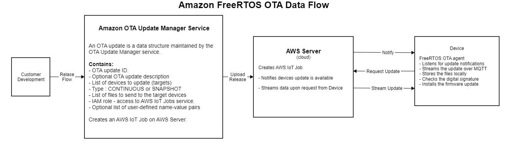
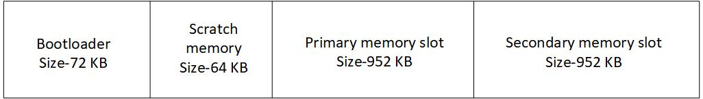

# Amazon FreeRTOS for PSoC 6 MCU - OTA

This code example demonstrates Over-the-Air (OTA) firmware update of PSoC 6® MCU running Amazon FreeRTOS. This example connects to the network for which the credentials are provided in *aws_credentials.h*. After connecting to the network successfully, the example establishes an MQTT connection to the AWS MQTT broker. The OTA Agent on the IoT device regularly checks for an OTA update job notification. Once the device is notified about the update, the device submits a request to download the firmware image. The AWS server streams the update, which is then stored locally on the device, verified with a code-signing certificate, and the new firmware is updated.


## Requirements

- [ModusToolbox™ IDE](https://www.cypress.com/products/modustoolbox-software-environment) v2.0

- [ModusToolbox Amazon FreeRTOS SDK](https://github.com/cypresssemiconductorco/amazon-freertos)

- [Cypress Programmer](https://www.cypress.com/documentation/software-and-drivers/cypress-programmer-archive)

- [CMake](https://cmake.org/download/)

- [Ninja](https://github.com/ninja-build/ninja/releases)

- [Python 3.7.4](https://www.python.org/downloads/release/python-374/)

- Associated Parts: All [PSoC® 6 MCU](http://www.cypress.com/PSoC6) parts with Amazon FreeRTOS support

## Supported Kits

- [PSoC 6 WiFi-BT Prototyping Kit](https://www.cypress.com/CY8CPROTO-062-4343W) (CY8CPROTO-062-4343W)  

## Hardware Setup

This example uses the kit’s default configuration. See the kit guide to ensure the kit is configured correctly.

**Note**: The PSoC 6 BLE Pioneer kit and the PSoC 6 WiFi-BT Pioneer kit ship with KitProg2 installed. ModusToolbox software requires KitProg3. Before using this code example, make sure that the kit is upgraded to KitProg3. The tool and instructions are available in the [Firmware Loader](https://github.com/cypresssemiconductorco/Firmware-loader) GitHub repository. If you do not upgrade, you will see an error like “unable to find CMSIS-DAP device” or “KitProg firmware is out of date”.

## Software Setup

### Tera Term

This example uses [Tera Term](https://ttssh2.osdn.jp/index.html.en) as the terminal emulator.

### Configuring Python 3.7.4
1. Install Python 3.7 if you don't have it installed on your PC.
2. Change your directory to *\<amazon-freertos>/vendors/cypress/apps/ota/scripts*. Install the packages listed in *requirements.txt*.
    ```
    pip3 install -r requirements.txt
    ```
**Note:** *\<amazon-freertos>* refers to the path of the Amazon FreeRTOS folder in your computer.

### Configuring AWS CLI

This example requires AWS CLI to be configured on the local machine to start the OTA update job. It is also possible to submit the OTA job manually through the web console. Refer to OTA Update Prerequisites and OTA Tutorial sub-sections under [Amazon FreeRTOS Over-the-Air Updates](https://docs.aws.amazon.com/freertos/latest/userguide/freertos-ota-dev.html) section in the Amazon FreeRTOS User Guide to submit an OTA job using the web console.
AWS CLI is installed as part of [Configuring Python 3.7.4](#configuring-python-3.7.4).

Open the command prompt and configure your Identity and Access Management credentials with AWS CLI. 

If no profile name is provided, the credentials are stored with the profile name as default. The command prompts you to enter your Access Key ID, AWS Secret Access Key, Region, and Output format. Ensure that you have  the Access Key ID and AWS Secret Access Key details or ask your AWS account administrator. 
```
 aws configure --profile <name_of_profile>
```
 - See [Region and Availability Zones](https://docs.aws.amazon.com/AmazonRDS/latest/UserGuide/Concepts.RegionsAndAvailabilityZones.html) to find the list of available regions. 
 - See [CLI usage output](https://docs.aws.amazon.com/cli/latest/userguide/cli-usage-output.html) to find the supported output formats.

## Using the Code Example

### First Steps

1. Create a new directory (e.g. dev) on your PC to download the example. The instructions here assume the following directory structure:
    ```  
    dev  
    |-- amazon-freertos  
    |-- mcuboot
    ```
2. Clone recursively or download MCUBoot from [GitHub](https://github.com/JuulLabs-OSS/mcuboot). 
    ```
    git clone https://github.com/JuulLabs-OSS/mcuboot.git --branch cypress --recursive
    ```
3. Clone recursively or download Amazon FreeRTOS from [GitHub](https://github.com/cypresssemiconductorco/amazon-freertos). 

   ```
   git clone --recursive https://github.com/cypresssemiconductorco/amazon-freertos.git
   ```
4. Connect the board to your PC using the provided USB cable through the USB connector.

5. Open a terminal program and select the KitProg3 COM port. Set the serial port parameters to 8N1 and 115200 baud.

   **Note:** *\<mcuboot>* refers to the path of the MCUBoot folder in your computer. 

### Configuring MCUBoot
1. MCUBoot and the OTA application must have the same understanding of the memory layout. Override the default memory layout by adding the following defines in the file *MCUBootApp.mk* located at *\<mcuboot>/boot/cypress/MCUBootApp*.
    ```
    DEFINES_APP +=-DMCUBOOT_MAX_IMG_SECTORS=2000
    DEFINES_APP +=-DCY_BOOT_BOOTLOADER_SIZE=0x12000
    DEFINES_APP +=-DCY_BOOT_SCRATCH_SIZE=0x10000
    DEFINES_APP +=-DCY_BOOT_PRIMARY_1_SIZE=0x0EE000
    DEFINES_APP +=-DCY_BOOT_SECONDARY_1_SIZE=0x0EE000
    ```
    These are the default values that are used. If you modify these values, ensure that the corresponding values in *CMakelists.txt* at *\<amazon_freertos>/vendors/cypress/boards/CY8CPROTO_062_4343W/* are also changed to new values.

2. The MCUBoot bootloader will use the `cypress-test-ec-p256` key-pair in *\<mcuboot>/boot/cypress/keys* by default. Because these keys will be available for everyone, **you must generate a new key-pair to ensure privacy**.
    #### Creating a New Key-Pair
    1. Open a command prompt. Change the directory to *\<mcuboot>/boot/cypress/keys*. Replace *\<filename>* with a name of your choice. 
    
    2. Generate the private key using the following command:
        ```
        openssl genkey -algorithm EC -pkeyopt ec_paramgen_curve:P-256 -pkeyopt ec_param_enc:named_curve -outform PEM -out <filename>.pem
        ```
    3. Create a new file *cert_config.txt* in the same directory with the following contents. Modify *\<user_name>* and *\<domain>* to match your credentials.
        ```
        [ req ]
        prompt             = no
        distinguished_name = my_dn
    
        [ my_dn ]
        commonName = <user_name>@<domain>.com
    
        [ my_exts ]
        keyUsage         = digitalSignature
        extendedKeyUsage = codeSigning
        ```
    4. Generate a code-signing certificate using the following command:
        ```
        openssl req -new -x509 -config cert_config.txt -extensions my_exts -nodes -days 365 -key <filename>.pem -out <filename>.crt
        ```
    5. Paste the contents of *\<filename>.crt* in *aws_ota_codesigner_certificate.h* at *\<amazon-freertos>/vendors/cypress/apps/ota/include*. Follow the format explained in the file. This is used to verify the signature generated by AWS and streamed with the image to the kit. 
    6. Generate a public key using the following command:
        ```
        ../../../scripts/imgtool.py getpub -k <filename>.pem > <filename>.pub
        ```
    7. Register the certificate and private key with AWS Certificate Manager (ACM).
        ```
        aws acm import-certificate --certificate file://<filename>.crt --private-key file://<filename>.pem --profile <profile_name > ../../../../amazon-freertos/vendors/cypress/apps/ota/scripts/certarn.json
    
        ```
    8. Update the value of `SIGN_KEY_FILE` in the `Makefile` at *\<mcuboot>/ boot/cypress* to match *\<filename>*.

3. If you are using the default key-pair, do the following to generate a code-signing certificate and register the certificate and private key with ACM as explained in [Creating a new Key-Pair](#creating-a-new-key-pair).

**Note**: MCUBootApp uses ModusToolbox 1.0 for GCC_ARM path. Edit the value of `TOOLCHAIN_PATH` in *toolchains.mk* at *<mcuboot>/boot/cypress/MCUBootApp/* to point to ModusToolbox 2.0 path as shown below:
```  
TOOLCHAIN_PATH ?= c:/Users/$(USERNAME)/ModusToolbox/tools_2.0/gcc-7.2.1
```

### Building MCUBoot

#### Using ModusToolbox IDE

1. Go to **File** > **Import**.

2. Choose **Existing Code as Makefile Project** under **C/C++** and click **Next**. 

3. Click the **Browse** button near **Select archive file**, choose the folder *\<mcuboot>/boot/cypress*, and click **Finish**.

4. Select the application project in the Project Explorer.

5. In the **Quick Panel**, scroll down, and click **Build cypress Application**.

#### Using Command-line Interface (CLI):

1. Open a CLI terminal and navigate to *\<mcuboot>/boot/cypress/*. 

2. Build the application using `make`:  
    ```
    make app APP_NAME=MCUBootApp TARGET=CY8CPROTO-062-4343W
    ```
    If you are using a new key-pair, you can also provide the name of the key in the build command instead of changing the value in `Makefile`.
    ```
    make app APP_NAME=MCUBootApp TARGET=CY8CPROTO-062-4343W SIGN_KEY_FILE=<filename>
    ```
### Programming MCUBoot

Use [Cypress Programmer](https://www.cypress.com/products/psoc-programming-solutions) to program the *MCUBootApp.elf* file generated under *\<mcuboot>/boot/cypress/MCUBootApp/out/CY8CPROTO_062_4343W/Debug*.

### Configuring Amazon FreeRTOS
1. Open *aws_credential.h* and *aws_credentialkeys.h* in *\<amazon-freertos>/vendors/cypress/apps/ota/include*. Update the SSID, password, security details of your Access Point (AP), the name of your Thing, and endpoint address in *aws_credential.h*. Update the security certificates for your Thing in *aws_credentialkeys.h*.

**Note**: If you haven't created a Thing, update *configure.json* in *\<amazon_freertos>/tools/aws_config_quick_start* with name of your Thing, SSID, password, and security details of the AP. Ensure that AWS CLI is set up beforehand as described in [Configuring AWS CLI](#configuring-aws-cli). Open a command prompt and run the following command:
    ```
    SetupAWS.py setup
    ```
Your details will be updated automatically in *aws_credential.h* and *aws_credentialkeys.h* at *\<amazon_freertos>/demos/include*. Copy these files into *\<amazon-freertos>/vendors/cypress/apps/ota/include*.

2. Ensure that the code-signing certificate is copied to *aws_ota_codesigner_certificate.h* at 
*\<amazon-freertos>/vendors/cypress/apps/ota/include*.

3. If you are not using the default key-pair, change the value of `MCUBOOT_KEY_FILE` in `Makefile` at *\<amazon-freertos>/projects/cypress/CY8CPROTO_062_4343W/mtb/ota* to match *\<filename>.pem*.

4. The OTA update image must have its version incremented for it to replace the existing image. Also, set `BLINK_FREQ_UPDATE_OTA` to 1 before building the OTA update image. This will change the blinking rate of the LED thereby providing a visual indicator for a sucessful OTA update.
- If you are using ModusToolbox IDE or make build system, the version of the example and `BLINK_FREQ_UPDATE_OTA` can be set in the `Makefile` at *\<amazon-freertos>/projects/cypress/CY8CPROTO_062_4343W/mtb/ota*. The default values are
   ```
    # Set BLINK_FREQ_UPDATE_OTA as 0/1 to change LED blink frequency.
    DEFINES+= BLINK_FREQ_UPDATE_OTA=0
    # Check for default Version values
    APP_VERSION_MAJOR?=1
    APP_VERSION_MINOR?=0
    APP_VERSION_BUILD?=0
   ```
- If you are using the CMake build system, the version of the example and `BLINK_FREQ_UPDATE_OTA` can be set in the command line as explained in [Using CMake](#using-cmake).

**Note**: If you are not following the folder structure mentioned in [First Steps](#first-steps), create a variable `MCUBOOT_DIR` in the `Makefile` at *\<amazon-freertos>/projects/cypress/CY8CPROTO_062_4343W/mtb/ota* and point to the correct location if you are using ModusToolbox IDE or make to build the example. If you are using the CMake build environment, add a define `--DMCUBOOT_DIR=<dir>` with `<dir>` pointing to the  correct location in the CMake configuration command. See [Using CMake](#using-cmake) for instructions on building using CMake.

### Building and Programming the Amazon FreeRTOS OTA Example

#### Using ModusToolbox IDE

1. Go to **File** > **Import**.

2. Choose **Existing Projects into Workspace** under **General** and click **Next**. 

3. Click the **Browse** button near **Select root directory**, choose the CE folder *\<amazon-freertos>/projects/cypress/CY8CPROTO_062_4343W/mtb/ota*, and click **Finish**.

4. Select the application project in the Project Explorer.

5. In the **Quick Panel**, scroll down, and click **ota Program (KitProg3)**.

6. Do not program the binary if it is the OTA update image. Instead, build the application by clicking **Build ota Application**.

To program a target board different from the default one defined using the `TARGET` variable in the makefile, you need to generate the launch configurations for the new target. See [Running Amazon FreeRTOS Code Examples - KBA228845](https://www.cypress.com/KBA228845) for details. 

#### Using Command-line Interface (CLI):

1. Open a CLI terminal and navigate to the CE folder. 

2. From the terminal, execute the `make program` command to build and program the application using the default toolchain to the default target. You can specify a target and toolchain manually:

   ```
   make program TARGET=<BSP> TOOLCHAIN=<toolchain>
   ```
   Example:

   ```
   make program TARGET=CY8CPROTO_062_4343W TOOLCHAIN=GCC_ARM
   ```
3. Do not program the binary if it is the OTA update image. Instead, build the application using the default toolchain to the default target with the `make build` command. You can specify a target and toolchain manually:
   ```
   make build TARGET=<BSP> TOOLCHAIN=<toolchain>
   ```
   Example:

   ```
   make build TARGET=CY8CPROTO_062_4343W TOOLCHAIN=GCC_ARM
   ```

#### Using `CMake`:

1. Create a build folder (e.g., *cmake_build*) under *\<amazon-freertos>/build*.

2. Run the following command from the build folder:

   ```
   cmake -G Ninja -S ../.. -B . -DVENDOR=cypress -DCOMPILER=arm-gcc -DBOARD=CY8CPROTO_062_4343W -DAPP=vendors/cypress/apps/ota -DAPP_VERSION_MAJOR=1 -DBLINK_FREQ_UPDATE_OTA=0
   ```
   For the OTA update image, change the version of the example by increasing the value of `APP_VERSION_MAJOR` such as `-DAPP_VERSION_MAJOR=2`in the build command. The LED blink frequency can also be changed in the command by setting `-DBLINK_FREQ_UPDATE_OTA=1`.

3. If you are not using the default key-pair in MCUBoot, provide the name of the new key-pair in the command line:
   ```
   cmake -G Ninja -S ../.. -B . -DVENDOR=cypress -DCOMPILER=arm-gcc -DBOARD=CY8CPROTO_062_4343W -DAPP=vendors/cypress/apps/ota -DAPP_VERSION_MAJOR=1 -DMCUBOOT_SIGN_KEY_FILE=<filename>.pem -DBLINK_FREQ_UPDATE_OTA=0
   ```

4. After `CMake` has generated the configuration, run the following command:

   ```
   cmake --build .
   ./sign_ota.sh
   ```
   *sign_ota.sh* is used to sign the generated image with the private key *<filename>.pem*. If `MCUBOOT_KEY_FILE` is not defined, the default key *cypress-test-ec-p256.pem*is used.

4. Use [Cypress Programmer](https://www.cypress.com/products/psoc-programming-solutions) to program the *ota.signed.hex* file generated under *\<amazon-freertos>/build/cmake_build*.

5. Do not program the binary if it is the updated version of the application.

## Operation
1. After the image is verified by the bootloader, the application starts executing. The application connects to the AP and establishes a connection to the AWS MQTT broker. It waits for OTA Job Notifications. The LED on the board blinks at 1 Hz if `BLINK_FREQ_UPDATE_OTA` is '0'. A sample serial output terminal is shown in [Figure 1](#figure-1-Factory-image-terminal-output).

##### Figure 1. Factory Image Terminal Output


2. Edit the version of the example and set `BLINK_FREQ_UPDATE_OTA` to 1 as described in[Configuring Amazon FreeRTOS OTA example](#configuring-amazon-freertos-ota-example).

3. Build the update image as explained in [Building and Programming Amazon FreeRTOS OTA example](#building-programming-amazon-freertos-ota-example).

4. Run the python script *start_ota.py* at *\<amazon-freertos>/vendors/cypress/apps/ota/scripts* to create the OTA job. Replace *\<name_of_profile>*, *\<name_of_thing>*, *\<name_of_role>*, *\<name_of_s3_bucket>*, and *\<name_of_signing_profile>* to match your credentials.
    ```
    cd dev/amazon-freertos/vendors/cypress/apps/ota/scripts
    python3 start_ota.py --profile <name_of_profile> --name <name_of_thing> --role ota-update-service-role --s3bucket <name_of_s3_bucket> --otasigningprofile <name_of_signing_profile> --codelocation ../../../../../ --appversion 2-0-0
    ```
   Once the device receives an OTA notification, it requests the updated image. AWS creates a stream and transfers the image to the device. A sample serial output is shown in [Figure 2](#figure-2-OTA-notification-terminal-output).

##### Figure 2. OTA Notification Terminal Output


5. After the transfer of the image is completed, the OTA Agent on the device verifies the signature provided by AWS with the image. Next, the bootloader validates the image with the public key. After successfully validating, the bootloader overwrites the image in the primary slot (which contains the factory image) with the secondary slot (which contains the update image). The LED now blinks at 4 Hz. A sample serial output is shown in [Figure 3](#figure-3-Running-update-image).

**Note**: After booting the update image, the version of the image is checked by the OTA Agent. If the version is older than that of the factory image, the OTA Agent rejects the image and forces a reset of the device. Since the factory image is lost after overwriting, the device boots the update image again. **Therefore, you must ensure that the version of the update image is always newer than the factory image.**

##### Figure 3. Running Update Image



## Design and Implementation
### Amazon FreeRTOS OTA Overview

The data flow for Amazon FreeRTOS OTA involves the following three entities:

1. **Customer**: The customer develops a new firmware for the target and sends the update to AWS. The customer is you, the person reading these instructions.

2. **Amazon Web Services (AWS)**:   
    - S3 
        - AWS S3 is a storage service. The new firmware developed by you must be uploaded to a S3 bucket. The image in S3 is then used by the OTA Update  Manager Service.
    - OTA Update Manager Service
        - The OTA Update Manager service provides a way to do the following:   
            - Create an OTA update.
            - Get information about an OTA update.
            - List all OTA updates associated with your AWS account.
            - Delete an OTA update. 
        - An OTA update is a data structure maintained by the OTA Update Manager service. It contains the following:   
            - An OTA update ID.
            - An optional OTA update description.
            - A list of devices to update (targets).
            - The type of OTA update: CONTINUOUS or SNAPSHOT.
            - A list of files to send to the target devices.
            - An IAM role that allows access to the AWS IoT Job service.
            - An optional list of user-defined name-value pairs.

        - After the files have been digitally signed, you need to create a stream to transfer the update. The service breaks up your files into blocks that can be sent over MQTT to your devices. The size of the blocks can be adjusted in the Amazon FreeRTOS OTA Agent code.

3. **Target that receives the OTA update**: For the target to receive OTA updates, the OTA agent must be running in the target. The OTA Agent enables you to manage the notification and download & verify firmware updates for Amazon FreeRTOS devices. By using the OTA Agent library, you can logically separate firmware updates and the application running on your devices. The OTA Agent library allows you to define application-specific logic for testing, committing, or rolling back a firmware update.

[Figure 4](#figure-4-amazon-freertos-ota-data-flow) illustrates the flow of information in the Amazon FreeRTOS OTA.

##### Figure 4. Amazon FreeRTOS OTA Data Flow



### Memory Layout in PSoC 6 with 2 MB Flash

The device has an internal flash of size 2 MB. The memory is partitioned into four regions as shown in [Figure 5](#figure-5-flash-memory-layout).

##### Figure 5. Flash Memory Layout


1. Bootloader region of size 72 KB.

2. Scratch memory of size 64 KB. MCUBoot supports images that are built to run from flash from a fixed location. If the update image downloaded to the secondary slot is to be executed then either primary slot is overwritten by the secondary slot or the two contents of two slots are swapped. This region is used for swapping between the primary and secondary slots. The Cypress port for MCUBoot currently doesn't support swapping.

3. Primary memory slot of size 952 KB. This region holds the factory image, which is currently being executed.

4. Secondary memory slot of size 952 KB. This region stores the update image.

It is important for both MCUBoot and the application to have the exact same understanding of the memory layout. Otherwise, the bootloader may consider an authentic image as invalid. To learn more about the bootloader refer to the [MCUBoot](https://github.com/JuulLabs-OSS/mcuboot/blob/cypress/docs/design.md) documentation.


### Script to Automate OTA Job Creation

The python script *start_ota.py* uses the following parameters:

- **profile**: This is a required parameter. This is same as the profile name you had provided in [Configuring AWS CLI](#configuring-aws-cli). If you had not provided any name, the value to be passed to the parameter is `default`. This parameter will help in obtaining information about the account-id by opening a session under the profile.

- **name**: This is a required parameter. This is the name of the Thing that you want to send the updated image to.

- **role**: This is a required parameter. This is the name of the role that has the requisite policies to perform OTA update. If the role name is not present in the list of roles, a new role will be created for you. Ensure that you have the IAMFullAccess policy attached to your IAM account to create a role using this script. Sample role policies that need to be attached can be found in *dev/amazon-freertos/vendors/cypress/apps/ota/scripts*.

- **s3bucket**: This is a required parameter. This is the name of the bucket that stores the updated image. If the name of the S3 bucket is not present in the list of buckets, then a new bucket will be created for you. Note that the name of the bucket must be a globally unique name. 

- **otasigningprofile**: This is a required parameter. This is the name of the signing profile that contains the code-signing certificate and private key that were generated in [Creating a new key-pair](#creating-a-new-key-pair). If the name is not present in the list of signing profile, a new signing profile is created for you. The profile is used by AWS to generate a signature for the binary image that is streamed to the target device. The signature is verified by the OTA Agent before the bootloader can initiate swap between primary and secondary memory slots.

- **appversion**: This is a required parameter. This corresponds to the version of the application. It should be of the format `APP_VERSION_MAJOR-APP_VERSION_MINOR-APP_VERSION_BUILD`. The default value is `0-0-0`.

- **codelocation**: This is an optional parameter. This value points to the path that *amazon-freertos* root directory is present. Default is `../../../../../../`.

- **signingcertificateid**: This is an optional parameter. While creating a new key-pair, the ARN generated for adding the certificates to AWS is stored in *certificatearn.json* at *dev/amazon-freertos/vendors/cypress/apps/ota/scripts*. The script uses this ARN when creating a new signing profile.

- **region**: This is an optional parameter. This is the region used by the IAM account, which can also be obtained from the *profile* parameter.

- **account**: This is an optional parameter. This is the account ID of the IAM account, which can be obtained from the *profile* parameter.

- **devicetype**: This is an optional parameter. The default value is `thing`. If you are deploying the updated image to a group, provide this parameter with the value set as `group`.

[Figure 6](#figure-6-flow-chart-of-start_ota.py) shows the operations performed by the Python script.

##### Figure 6. Flowchart of *start_ota.py*


To summarize, the script will create the S3 Bucket and Role if they have not been created already. Creating a role requires the IAMFullAccess policy to be attached to your IAM account. Contact your administrator to attach the policy to your account. If your account administrator doesn't provide you with IAMFullAccess, ask your administrator to create a role for you using the *start_ota.py* script. Before starting the OTA Job, the script picks the binary image, creates a copy, renames it to include the version information, and uploads it to the S3 Bucket. Then, it creates a signing profile if it isn't already present, and creates an OTA Job with the latest version of the file in the S3 bucket. 

**Note**: `start_ota.py` uses the build path *\<amazon-freertos>/build/cy/ota/CY8CPROTO-062-4343W/Debug* which is the default path used in ModusToolbox 2.0. If you are using a differnt build path, search for `self.BUILD_PATH` and update in the script.

## Related Resources

| Application Notes                                            |                                                              |
| :----------------------------------------------------------- | :----------------------------------------------------------- |
| [AN228571](https://www.cypress.com/AN228571) – Getting Started with PSoC 6 MCU on ModusToolbox | Describes PSoC 6 MCU devices and how to build your first application with ModusToolbox |
| [AN221774](https://www.cypress.com/AN221774) – Getting Started with PSoC 6 MCU on PSoC Creator | Describes PSoC 6 MCU devices and how to build your first application with PSoC Creator |
| [AN210781](https://www.cypress.com/AN210781) – Getting Started with PSoC 6 MCU with Bluetooth Low Energy (BLE) Connectivity on PSoC Creator | Describes PSoC 6 MCU with BLE Connectivity devices and how to build your first application with PSoC Creator |
| [AN215656](https://www.cypress.com/AN215656) – PSoC 6 MCU: Dual-CPU System Design | Describes the dual-CPU architecture in PSoC 6 MCU, and shows how to build a simple dual-CPU design |
| **Code Examples**                                            |                                                              |
| [Using ModusToolbox IDE](https://github.com/cypresssemiconductorco/Code-Examples-for-ModusToolbox-Software) | [Using PSoC Creator](https://www.cypress.com/documentation/code-examples/psoc-6-mcu-code-examples) |
| **Device Documentation**                                     |                                                              |
| [PSoC 6 MCU Datasheets](https://www.cypress.com/search/all?f[0]=meta_type%3Atechnical_documents&f[1]=resource_meta_type%3A575&f[2]=field_related_products%3A114026) | [PSoC 6 Technical Reference Manuals](https://www.cypress.com/search/all/PSoC%206%20Technical%20Reference%20Manual?f[0]=meta_type%3Atechnical_documents&f[1]=resource_meta_type%3A583) |
| **Development Kits**                                         | Buy at www.cypress.com                                       |
| [CY8CKIT-062-BLE](https://www.cypress.com/CY8CKIT-062-BLE) PSoC 6 BLE Pioneer Kit | [CY8CKIT-062-WiFi-BT](https://www.cypress.com/CY8CKIT-062-WiFi-BT) PSoC 6 WiFi-BT Pioneer Kit |
| [CY8CPROTO-063-BLE](https://www.cypress.com/CY8CPROTO-063-BLE) PSoC 6 BLE Prototyping Kit | [CY8CPROTO-062-4343W](https://www.cypress.com/cy8cproto-062-4343w) PSoC 6 Wi-Fi BT Prototyping Kit |
| [CY8CKIT-062S2-43012](https://www.cypress.com/CY8CKIT-062S2-43012) PSoC 62S2 Wi-Fi BT Pioneer Kit |                                                              |
| **Libraries**                                                |                                                              |
| PSoC 6 Peripheral Driver Library and docs                    | [psoc6pdl](https://github.com/cypresssemiconductorco/psoc6pdl) on GitHub |
| Cypress Hardware Abstraction Layer Library and docs          | [psoc6hal](https://github.com/cypresssemiconductorco/psoc6hal) on GitHub |
| RetargetIO - A utility library to retarget the standard input/output (STDIO) messages to a UART port | [retarget-io](https://github.com/cypresssemiconductorco/retarget-io) on GitHub |
| **Middleware**                                               |                                                              |
| CapSense library and docs                                    | [capsense](https://github.com/cypresssemiconductorco/capsense) on GitHub |
| Links to all PSoC 6 MCU Middleware                           | [psoc6-middleware](https://github.com/cypresssemiconductorco/psoc6-middleware) on GitHub |
| **Tools**                                                    |                                                              |
| [ModusToolbox IDE](https://www.cypress.com/modustoolbox)     | The Cypress IDE for PSoC 6 MCU and IoT designers             |
| [PSoC Creator](https://www.cypress.com/products/psoc-creator-integrated-design-environment-ide) | The Cypress IDE for PSoC and FM0+ MCU development            |

## Other Resources

Cypress provides a wealth of data at www.cypress.com to help you to select the right device, and quickly and effectively integrate the device into your design.

For the PSoC 6 MCU devices, see [KBA223067](https://community.cypress.com/docs/DOC-14644) in the Cypress community for a comprehensive list of PSoC 6 MCU resources.

## Document History

Document Title: *Amazon FreeRTOS for PSoC 6 MCU - OTA*

| Revision     | Description of Change |
| --------     | --------------------- |
| v1.0.0       | New code example      |

------

All other trademarks or registered trademarks referenced herein are the property of their respective
owners.


-------------------------------------------------------------------------------

© Cypress Semiconductor Corporation, 2019. This document is the property of Cypress Semiconductor Corporation and its subsidiaries (“Cypress”). This document, including any software or firmware included or referenced in this document (“Software”), is owned by Cypress under the intellectual property laws and treaties of the United States and other countries worldwide. Cypress reserves all rights under such laws and treaties and does not, except as specifically stated in this paragraph, grant any license under its patents, copyrights, trademarks, or other intellectual property rights. If the Software is not accompanied by a license agreement and you do not otherwise have a written agreement with Cypress governing the use of the Software, then Cypress hereby grants you a personal, non-exclusive, nontransferable license (without the right to sublicense) (1) under its copyright rights in the Software (a) for Software provided in source code form, to modify and reproduce the Software solely for use with Cypress hardware products, only internally within your organization, and (b) to distribute the Software in binary code form externally to end users (either directly or indirectly through resellers and distributors), solely for use on Cypress hardware product units, and (2) under those claims of Cypress’s patents that are infringed by the Software (as provided by Cypress, unmodified) to make, use, distribute, and import the Software solely for use with Cypress hardware products. Any other use, reproduction, modification, translation, or compilation of the Software is prohibited.
TO THE EXTENT PERMITTED BY APPLICABLE LAW, CYPRESS MAKES NO WARRANTY OF ANY KIND, EXPRESS OR IMPLIED, WITH REGARD TO THIS DOCUMENT OR ANY SOFTWARE OR ACCOMPANYING HARDWARE, INCLUDING, BUT NOT LIMITED TO, THE IMPLIED WARRANTIES OF MERCHANTABILITY AND FITNESS FOR A PARTICULAR PURPOSE. No computing device can be absolutely secure. Therefore, despite security measures implemented in Cypress hardware or software products, Cypress shall have no liability arising out of any security breach, such as unauthorized access to or use of a Cypress product. CYPRESS DOES NOT REPRESENT, WARRANT, OR GUARANTEE THAT CYPRESS PRODUCTS, OR SYSTEMS CREATED USING CYPRESS PRODUCTS, WILL BE FREE FROM CORRUPTION, ATTACK, VIRUSES, INTERFERENCE, HACKING, DATA LOSS OR THEFT, OR OTHER SECURITY INTRUSION (collectively, “Security Breach”). Cypress disclaims any liability relating to any Security Breach, and you shall and hereby do release Cypress from any claim, damage, or other liability arising from any Security Breach. In addition, the products described in these materials may contain design defects or errors known as errata which may cause the product to deviate from published specifications. To the extent permitted by applicable law, Cypress reserves the right to make changes to this document without further notice. Cypress does not assume any liability arising out of the application or use of any product or circuit described in this document. Any information provided in this document, including any sample design information or programming code, is provided only for reference purposes. It is the responsibility of the user of this document to properly design, program, and test the functionality and safety of any application made of this information and any resulting product. “High-Risk Device” means any device or system whose failure could cause personal injury, death, or property damage. Examples of High-Risk Devices are weapons, nuclear installations, surgical implants, and other medical devices. “Critical Component” means any component of a High-Risk Device whose failure to perform can be reasonably expected to cause, directly or indirectly, the failure of the High-Risk Device, or to affect its safety or effectiveness. Cypress is not liable, in whole or in part, and you shall and hereby do release Cypress from any claim, damage, or other liability arising from any use of a Cypress product as a Critical Component in a High-Risk Device. You shall indemnify and hold Cypress, its directors, officers, employees, agents, affiliates, distributors, and assigns harmless from and against all claims, costs, damages, and expenses, arising out of any claim, including claims for product liability, personal injury or death, or property damage arising from any use of a Cypress product as a Critical Component in a High-Risk Device. Cypress products are not intended or authorized for use as a Critical Component in any High-Risk Device except to the limited extent that (i) Cypress’s published data sheet for the product explicitly states Cypress has qualified the product for use in a specific High-Risk Device, or (ii) Cypress has given you advance written authorization to use the product as a Critical Component in the specific High-Risk Device and you have signed a separate indemnification agreement.
Cypress, the Cypress logo, Spansion, the Spansion logo, and combinations thereof, WICED, PSoC, CapSense, EZ-USB, F-RAM, and Traveo are trademarks or registered trademarks of Cypress in the United States and other countries. For a more complete list of Cypress trademarks, visit cypress.com. Other names and brands may be claimed as property of their respective owners.